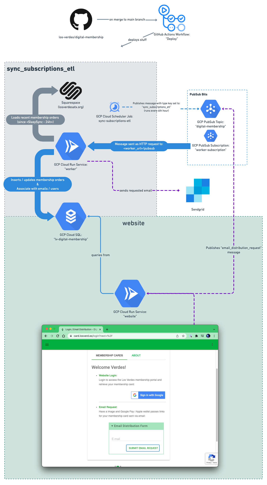

# digital-membership

[](https://github.com/los-verdes/digital-membership/actions/workflows/main.yml)
[](https://github.com/los-verdes/digital-membership/actions/workflows/lint.yml)
[](https://github.com/los-verdes/digital-membership/actions/workflows/run_tests.yml)

Digital membership card site with Squarespace-sourced membership database.

A live production version of this site (directed at members of the [Los Verdes supporters group](https://www.losverdesatx.org/)) may be viewed at: [card.losverd.es](https://card.losverd.es/).

## Application Architecture

The core components of the application are:

- **[flask](https://flask.palletsprojects.com/en/2.0.x/)** - Used to construct both the frontend ("site") app that serves requests to [card.losverd.es](https://card.losverd.es/) and a background tasks ("worker") app responsible for generating Google Pay / Apple Wallet passes, sending out emails, etc.
- **[Squarespace's Commerce APIs](https://developers.squarespace.com/commerce-apis/overview)** - Source of truth for membership orders. Which are then loaded into to...:
- **[GCP Cloud SQL for PostgreSQL](https://cloud.google.com/sql)** - User and membership database.

### System Diagram



### Deployment

Outside of this repository, all infrastructure resources are housed in an associated Google Cloud Platform (GCP) project. Resource lifecycle is primarily handled by Terraform and the [Deploy](https://github.com/los-verdes/digital-membership/actions/workflows/deploy.yml) GitHub actions workflow.

### Initial Setup

When first provisioning a new GCP project / deployment, some bits of configuration need to be manually established as their creation isn't handled as part of automated deployments (typically due to no, or poor, API support, etc.). These bits include:

1. [Access to the Google Pay API for passes](https://developers.google.com/pay/passes/guides/basic-setup/get-access-to-rest-api)
1. [An Apple Developer account](https://developer.apple.com/account)
1. Google OAuth2 Client

#### Google Pay API for Passes

TODO: `<fill this bit in>`

#### Apple Developer Account

TODO: `<fill this bit in>`

#### OAuth2 Configuration

1. Set up the OAuth consent screen for the desired project via the [GCP Console](https://console.cloud.google.com/apis/credentials/consent)
1. Visit the [Google API Console](https://console.cloud.google.com/apis/dashboard?project=lv-digital-membership) to obtain OAuth 2.0 credentials.

TODO: `<fill this bit in>`

### Development

For development against the [card.losverd.es production site](https://card.losverd.es), you will need:

- Access to the associated GCP project. This is done by inserting whatever username is associated with your [gcloud application-default credentials](https://cloud.google.com/sdk/gcloud/reference/auth/application-default/login) in the `gcp_project_editors`lists defined in [terraform/variables.tf](terraform/variables.tf)
- Afterwards, be sure to set up `gcloud` and configure it for this project:

    ```shellsession
    $ gcloud auth application-default login
    $ gcloud config set project 'lv-digital-membership'
    Updated property [core/project].
    export EVENTS_PAGE_SA_EMAIL="$(terraform -chdir=terraform output -raw site_publisher_sa_email)"
    ./events_page/app.py
    ```

- [Optional] Install [just](https://github.com/casey/just)

TODO: `<fill this bit in>`
